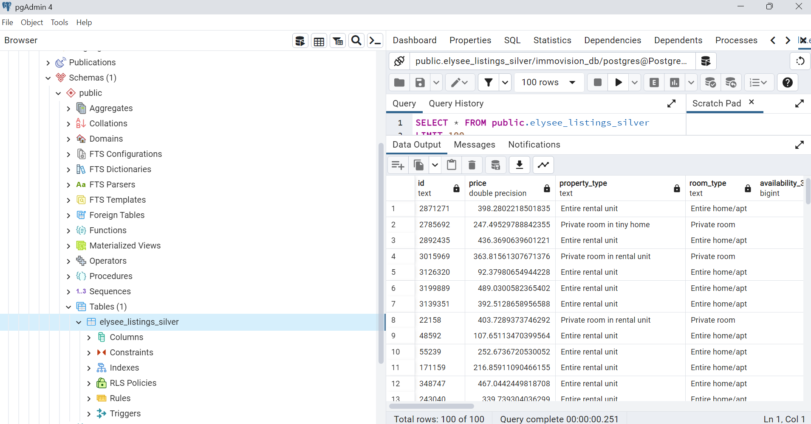

# README_LOAD — Chargement vers PostgreSQL (Data Warehouse)

## Objectif

Le script `06_load.py` constitue la dernière étape du pipeline ETL : injecter le fichier Silver (`transformed_elysee.csv`) dans une base de données PostgreSQL, transformant ainsi des fichiers plats en un entrepôt de données relationnelles requêtable.

## Prérequis

### 1. Installer PostgreSQL
Télécharger sur https://www.postgresql.org/download/ et installer.

### 2. Créer la base de données
Dans pgAdmin ou psql :
```sql
CREATE DATABASE immovision_db;
```

### 3. Configurer le fichier .env
Créer un fichier `.env` à la racine du projet :
```
DB_USER=postgres
DB_PASSWORD=votre_mot_de_passe
DB_HOST=localhost
DB_PORT=5432
DB_NAME=immovision_db
```

### 4. Installer les dépendances Python
```bash
pip install sqlalchemy psycopg2-binary python-dotenv
```

## Exécution

```bash
python scripts/06_load.py
```

## Table créée : `elysee_listings_silver`

| Colonne | Type SQL | Description |
|---|---|---|
| id | TEXT | Identifiant unique de l'annonce |
| price | FLOAT | Prix par nuit (€) |
| property_type | TEXT | Type de bien |
| room_type | TEXT | Type de location |
| availability_365 | INTEGER | Jours disponibles par an |
| calculated_host_listings_count | INTEGER | Nombre d'annonces par hôte |
| host_id | TEXT | Identifiant de l'hôte |
| host_since | DATE | Date d'inscription de l'hôte |
| host_response_time | TEXT | Délai de réponse |
| host_response_rate | FLOAT | Taux de réponse (0-1) |
| host_is_superhost | INTEGER | Superhost (1=oui, 0=non) |
| number_of_reviews | INTEGER | Nombre total d'avis |
| review_scores_rating | FLOAT | Note globale |
| reviews_per_month | FLOAT | Avis par mois |
| latitude | FLOAT | Latitude GPS |
| longitude | FLOAT | Longitude GPS |
| neighbourhood_cleansed | TEXT | Quartier |
| accommodates | INTEGER | Capacité max |
| bedrooms | FLOAT | Nombre de chambres |
| beds | FLOAT | Nombre de lits |
| Standardization_Score | INTEGER | Score standardisation visuelle (1/0/-1) |
| Neighborhood_Impact | INTEGER | Impact social NLP (1/0/-1) |

## Idempotence

Le script utilise `if_exists='replace'` : la table est entièrement recréée à chaque exécution. Cela garantit qu'un re-run ne duplique jamais les données.

## Preuve d'exécution

